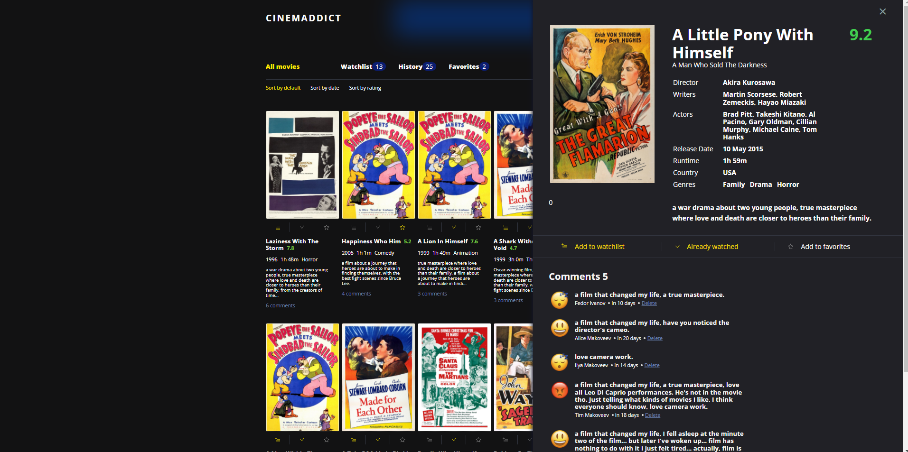

# Что это
Это переделанный на React и TypeScript проект Html-Academy Cinema Dict;

( <a href="https://github.com/gitSergeyhab/1661607-cinemaddict-15">Здесь эиот же проект, выполненный на чистом JS </a> )


## BRANCHES

<b>master: ```RTK```;

<b>rtkq:</b> RTK with ```RTK Query```;

# Используются библиотеки

```react``` ```redux``` ```@reduxjs/toolkit``` ```chart.js``` ```dayjs``` ```...```

## Деплой на vercel:

https://cinemadict-react.vercel.app/

<a href="https://cinemadict-react.vercel.app/">
  
</a>

### Запуск проекта

```bash
npm start
```
